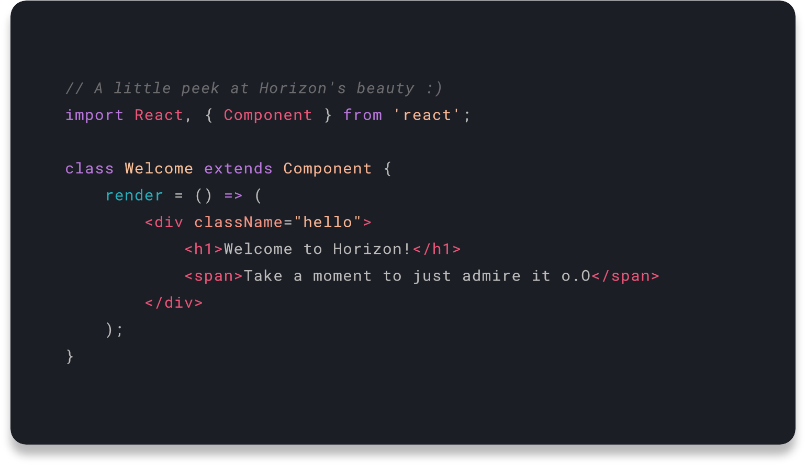

# Horizon for Prism.js

Original theme by [Jonathan Olaleye](https://github.com/jolaleye/) you can found the theme here : [https://github.com/jolaleye/horizon-theme-vscode](https://github.com/jolaleye/horizon-theme-vscode)

## Preview

<p align="center">
  
  
</p>

## Notes

The stylesheet is not perfect and it was tested only on `JSX` syntax.

Feel free to submit issues or to fix them by submitting a PR.


## Install

```bash
> npm i horizon-prismjs-theme
```

```js
import 'horizon-prismjs-theme/theme.css';
```


## Usage

```jsx
// A little peek at Horizon's beauty :)
import React, { Component } from 'react';

class Welcome extends Component {
  render = () => (
      <div className="hello">
        <h1>Welcome to Horizon!</h1>
        <span>Take a moment to just admire it o.O</span>
      </div>
    );
  }
}
```